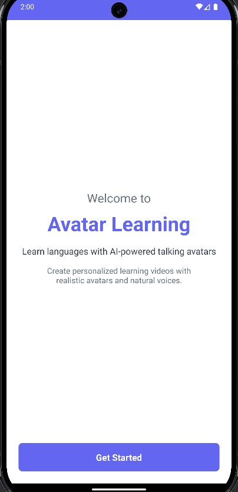
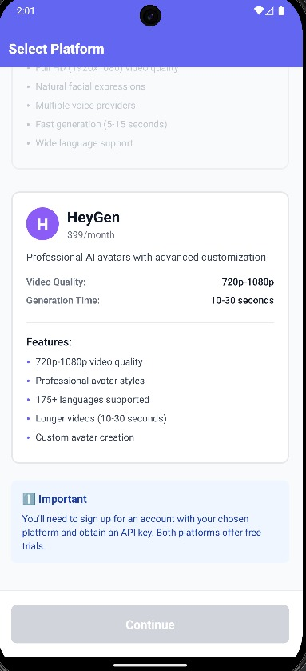
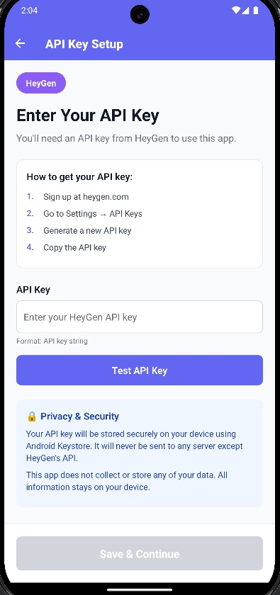
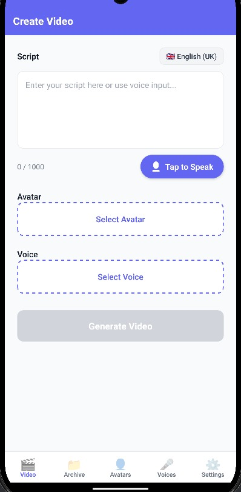
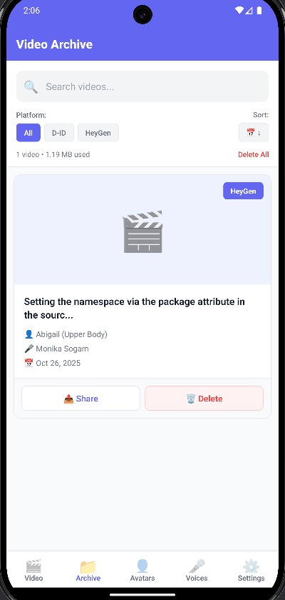
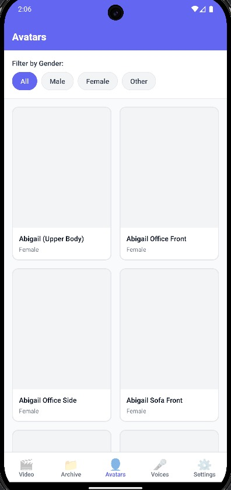
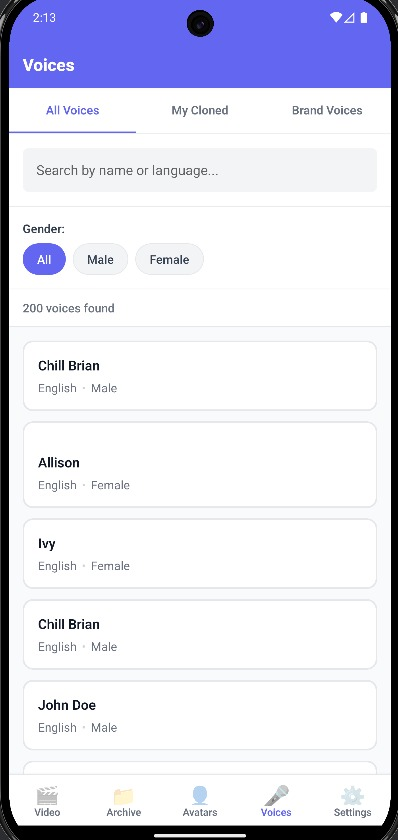

# 🎓 Avatar Learning App

<div align="center">



**English | [Türkçe](README.tr.md)**

> **AI-Powered Personalized Avatar Videos**

Create talking avatar videos! Clone your voice, create avatars from your photos, or produce content with professional avatars. A React Native mobile app powered by D-ID or HeyGen platforms.

[](https://reactnative.dev/)
[](https://www.typescriptlang.org/)
[](LICENSE)

</div>

---

## 📱 Screenshots

<div align="center">

| Platform Selection | API Key Setup | Video Creation |
|:---:|:---:|:---:|
|  |  |  |

| Video Archive | Avatar Catalog | Voice Catalog |
|:---:|:---:|:---:|
|  |  |  |

</div>

---

## 🚀 How It Works?

<div align="center">
  
</div>

### 1️⃣ Select Platform and Enter API Key

- Choose **D-ID** or **HeyGen** platform
- Save your API key securely
- Access platform features

### 2️⃣ Choose Avatar and Voice

- Select from **50+ ready-made avatars**
- Browse **100+ professional voices** catalog
- Or create your own avatar and voice

### 3️⃣ Create Script

- Type text or **speak** to create script
- 13 language support (Turkish, English, German, etc.)
- Real-time speech recognition

### 4️⃣ Generate Video

- Create video with a few clicks
- Video ready in 2-3 minutes
- Watch, save, or delete your videos

---

## ✨ Key Features

<div align="center">
  
</div>

### 🎬 Video Generation

- Text or voice script input
- 50+ avatar options (male, female, diverse ethnicities)
- 100+ voice options (Microsoft, ElevenLabs, Amazon technologies)
- Real-time progress tracking
- Average 2-3 minutes generation time

### 🎤 Voice Cloning (D-ID Pro)

- **Clone your own voice** - 3 recordings required (30+ seconds each)
- Avatars speaking with your voice in videos
- Local voice profile management
- Requires D-ID Pro plan

### 🎭 Custom Avatar (D-ID)

- **Create avatar from your photo**
- Realistic animation with AI
- Local avatar profile management
- D-ID Lite/Pro plan sufficient

### 🗣️ Voice Script Input

- 13 language support: Turkish 🇹🇷, English 🇺🇸🇬🇧, German 🇩🇪, Spanish 🇪🇸, French 🇫🇷, Italian 🇮🇹, Portuguese 🇵🇹, Russian 🇷🇺, Arabic 🇸🇦, Chinese 🇨🇳, Japanese 🇯🇵, Korean 🇰🇷
- Real-time speech recognition
- Edit and correction capability

### 📹 Video Management

- Full control video player
- Video archive and search
- Filter by name, avatar, voice
- Sort by date/name
- Local storage (all videos on your device)

---

## 📱 Supported Platforms

- **iOS**: iPhone 6s and later (iOS 13.0+)
- **Android**: Android 6.0+ (API Level 23)

---

## 🚀 Installation

### Requirements

- Node.js >= 18
- React Native development environment
- **For iOS**: Xcode, CocoaPods, macOS
- **For Android**: Android Studio, JDK 17

### Installation Steps

```powershell
# Install dependencies
npm install

# iOS setup (macOS only)
cd ios && pod install && cd ..

# Run the app
npm run ios      # iOS
npm run android  # Android
```

---

## 🔑 Getting API Keys

### D-ID (Recommended - All Features)

<div align="center">
  
</div>

**Supported:**

- ✅ Video generation
- ✅ Voice cloning (with Pro plan)
- ✅ Custom avatar creation

**How to Get:**

1. Create account at [D-ID.com](https://www.d-id.com/)
2. Dashboard → API Key
3. Copy the key
4. Enter in the app

**Pricing:**

- Lite: $5.90/month (20 videos)
- Pro: $49/month (90 videos + voice cloning)

### HeyGen (Alternative - Basic Features)

<div align="center">
  
</div>

**Supported:**

- ✅ Video generation
- ❌ Voice cloning
- ❌ Custom avatar

**How to Get:**

1. Create account at [HeyGen.com](https://www.heygen.com/)
2. Settings → API Keys
3. Copy the key
4. Enter in the app

**Pricing:**

- Creator: $29/month (15 minutes video)
- Business: $89/month (90 minutes video)

---

## 💡 Usage Guide

### First Video Creation (5 Minutes)

<div align="center">
  
</div>

**1. Platform and API Key (1 min)**

- Choose D-ID or HeyGen
- Enter and verify your API key

**2. Select Avatar (1 min)**

- Choose from Avatar Catalog
- Or create from your photo (D-ID)

**3. Select Voice (1 min)**

- Choose from Voice Catalog
- Or clone your voice (D-ID Pro)

**4. Enter Script (1 min)**

- Type text or tap 🎤 to speak
- Example: "Hello! Today I'll talk about avatar videos."

**5. Generate Video (2-3 min)**

- Tap "Generate Video" button
- Follow progress bar
- Video ready! 🎉

### Voice Cloning (D-ID Pro)

**Requirements:**
- D-ID Pro plan ($49/month)
- 3 audio recordings (30+ seconds each)
- Quiet environment

**Steps:**
1. Voice Catalog → Tap "Clone Voice" button
2. Accept consent agreement
3. Read 3 different texts (30+ seconds/recording)
4. Upload to D-ID
5. Profile saved - use in your videos!

**Tips:**
- Record in a quiet room
- Stay 20-30 cm from microphone
- Speak naturally at normal speed
- Clean recording without cough/noise

### Custom Avatar (D-ID)

**Requirements:**
- D-ID account (Lite plan sufficient)
- Good quality photo

**Steps:**
1. Avatar Catalog → "Create Custom Avatar"
2. Accept consent agreement
3. Take photo or select from gallery
4. Upload to D-ID
5. Avatar created - use in your videos!

**For Good Photo:**
- ✅ Bright environment (natural light)
- ✅ Face clear and centered
- ✅ Look directly at camera
- ✅ Plain background (white wall)
- ❌ No glasses, hat, mask
- ❌ No side profile

---

## ❓ FAQ

**Q: Is the app free?**
A: Yes, but requires D-ID/HeyGen API key (paid).

**Q: Which platform should I choose?**
A: **D-ID** for voice cloning and custom avatar, **HeyGen** sufficient for standard videos only.

**Q: How long does video generation take?**
A: Average 2-3 minutes.

**Q: What's the maximum video length?**
A: ~500 words (3-4 minutes speech) recommended.

**Q: Where are my videos stored?**
A: All videos, voices, and photos are stored only on your phone.

**Q: Is internet required?**
A: Only when generating videos. No internet needed to watch created videos.

**Q: Getting "Invalid API key" error**
A: Check API key, ensure you have credits and selected correct platform.

**Q: Voice not recognized**
A: Grant microphone permission, speak slowly and clearly in quiet environment, select correct language.

---

## 🎓 Use Cases

- **Educators**: Online course content, student messages
- **Students**: Presentation practice, language learning
- **Business**: Employee training, product demos
- **Personal**: Language practice, social media content

---

## 🏗️ Architecture & Features

<div align="center">
  
  
</div>

### Tech Stack

- **Frontend**: React Native CLI 0.73.11
- **Type Safety**: TypeScript 5.0.4
- **JavaScript Engine**: Hermes
- **Navigation**: React Navigation 6.x
- **State Management**: React Hooks

### Security

- **API Keys**: iOS Keychain / Android Keystore (hardware-backed)
- **Videos**: Local storage with react-native-fs
- **Preferences**: AsyncStorage (encrypted)
- **Privacy**: Zero cloud storage - 100% on-device

### API Integrations

- **D-ID API**: `https://api.d-id.com`
  - Video generation
  - Voice cloning
  - Custom avatar upload
- **HeyGen API**: `https://api.heygen.com`
  - Video generation
  - Avatar & voice catalogs
- **ElevenLabs**: Speech-to-text (13 languages)

---

## 🔧 Technical Details

**Technology Stack:**

- React Native CLI 0.73.11
- TypeScript 5.0.4
- iOS & Android (Hermes)

**Security:**

- API keys: iOS Keychain / Android Keystore
- Videos: Local storage (react-native-fs)
- Preferences: AsyncStorage

**API Integrations:**

- D-ID API: `https://api.d-id.com`
- HeyGen API: `https://api.heygen.com`

---

## 📄 License

This project is licensed under the MIT License - see the [LICENSE](LICENSE) file for details.

Educational project designed for learning and personal use.

---

<div align="center">

**Built with ❤️ using React Native and AI**

⭐ **Star** | 📢 **Share** | 💬 **Feedback**

---

Last Updated: October 27, 2025 | Version: 0.0.1

</div>
