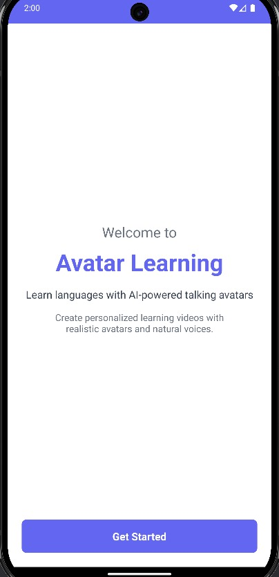
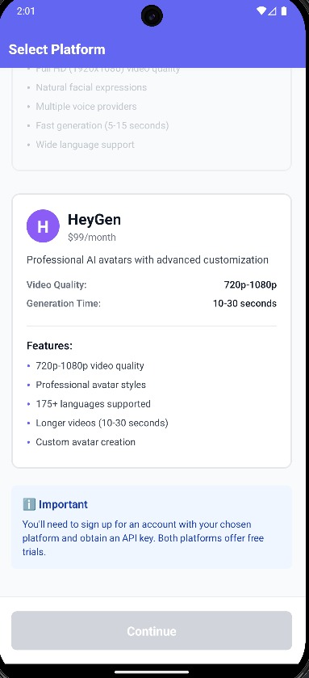
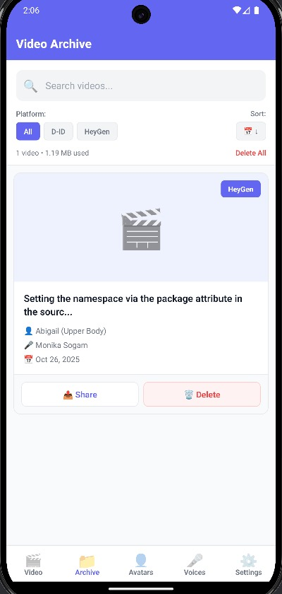
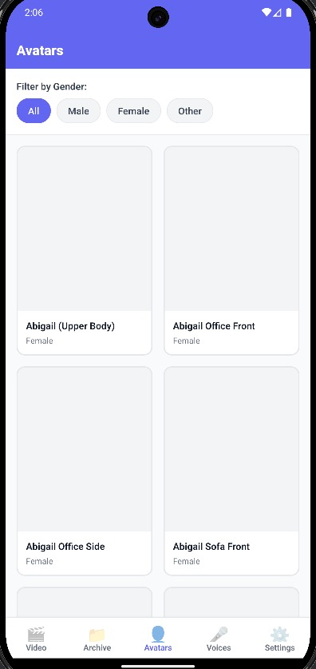

# 🎓 Avatar Learning App

<div align="center">



**[English](README.md) | Türkçe**

> **Yapay Zeka Destekli Kişiselleştirilmiş Avatar Videoları**

Konuşan avatar videoları oluşturun! Kendi sesinizi klonlayın, fotoğrafınızdan avatar yapın veya profesyonel avatarlarla içerik üretin. D-ID veya HeyGen platformlarıyla çalışan React Native mobil uygulama.

[](https://reactnative.dev/)
[](https://www.typescriptlang.org/)
[](LICENSE)

</div>

---

## 📱 Ekran Görüntüleri

<div align="center">

| Platform Seçimi | API Key Kurulumu | Video Oluşturma |
|:---:|:---:|:---:|
|  |  |  |

| Video Arşivi | Avatar Kataloğu | Ses Kataloğu |
|:---:|:---:|:---:|
|  |  |  |

</div>

---

## 🚀 Nasıl Çalışır?

<div align="center">
  
</div>

### 1️⃣ Platform Seçin ve API Anahtarı Girin

- **D-ID** veya **HeyGen** platformundan birisini seçin
- API anahtarınızı güvenli şekilde kaydedin
- Platform özelliklerine erişin

### 2️⃣ Avatar ve Ses Seçin

- **50+ hazır avatar** arasından seçim yapın
- **100+ profesyonel ses** katalogunu inceleyin
- Veya kendi avatarınızı ve sesinizi oluşturun

### 3️⃣ Script Oluşturun

- Metin yazın veya **sesli konuşarak** script girin
- 13 dil desteği (Türkçe, İngilizce, Almanca, vb.)
- Real-time konuşma tanıma

### 4️⃣ Video Üretin

- Birkaç tıklamayla video oluşturun
- 2-3 dakikada videonuz hazır
- Videolarınızı izleyin, saklayın veya silin

---

## ✨ Temel Özellikler

<div align="center">
  
</div>

### 🎬 Video Oluşturma

- Metin veya sesle script girişi
- 50+ avatar seçeneği (erkek, kadın, farklı etnik köken)
- 100+ ses seçeneği (Microsoft, ElevenLabs, Amazon teknolojileri)
- Gerçek zamanlı ilerleme takibi
- Ortalama 2-3 dakika oluşturma süresi

### 🎤 Ses Klonlama (D-ID Pro)

- **Kendi sesinizi klonlayın** - 3 kayıt yeterli (30+ saniye/kayıt)
- Videolarınızda kendi sesinizle konuşan avatarlar
- Yerel ses profili yönetimi
- D-ID Pro plan gerektirir

### 🎭 Özel Avatar (D-ID)

- **Fotoğrafınızdan avatar oluşturun**
- Yapay zeka ile gerçekçi animasyon
- Yerel avatar profili yönetimi
- D-ID Lite/Pro plan yeterli

### 🗣️ Sesli Script Girişi

- 13 dil desteği: Türkçe 🇹🇷, İngilizce 🇺🇸🇬🇧, Almanca 🇩🇪, İspanyolca 🇪🇸, Fransızca 🇫🇷, İtalyanca 🇮🇹, Portekizce 🇵🇹, Rusça 🇷🇺, Arapça 🇸🇦, Çince 🇨🇳, Japonca 🇯🇵, Korece 🇰🇷
- Gerçek zamanlı konuşma tanıma
- Düzenleme ve düzeltme imkanı

### 📹 Video Yönetimi

- Tam kontrol video oynatıcı
- Video arşivi ve arama
- İsim, avatar, ses bazlı filtreleme
- Tarih/isim bazlı sıralama
- Yerel depolama (tüm videolar cihazınızda)

---

## 📱 Desteklenen Platformlar

- **iOS**: iPhone 6s ve üzeri (iOS 13.0+)
- **Android**: Android 6.0+ (API Level 23)

---

## 🚀 Kurulum

### Gereksinimler

- Node.js >= 18
- React Native geliştirme ortamı
- **iOS için**: Xcode, CocoaPods, macOS
- **Android için**: Android Studio, JDK 17

### Kurulum Adımları

```powershell
# Bağımlılıkları yükle
npm install

# iOS kurulumu (sadece macOS)
cd ios && pod install && cd ..

# Uygulamayı çalıştır
npm run ios      # iOS
npm run android  # Android
```

---

## 🔑 API Anahtarı Alma

### D-ID (Önerilen - Tüm Özellikler)

<div align="center">
  
</div>

**Desteklenen:**

- ✅ Video oluşturma
- ✅ Ses klonlama (Pro plan ile)
- ✅ Özel avatar oluşturma

**Nasıl Alınır:**

1. [D-ID.com](https://www.d-id.com/) hesap oluşturun
2. Dashboard → API Key
3. Anahtarı kopyalayın
4. Uygulamaya girin

**Fiyatlandırma:**

- Lite: $5.90/ay (20 video)
- Pro: $49/ay (90 video + ses klonlama)

### HeyGen (Alternatif - Temel Özellikler)

<div align="center">
  
</div>

**Desteklenen:**

- ✅ Video oluşturma
- ❌ Ses klonlama
- ❌ Özel avatar

**Nasıl Alınır:**

1. [HeyGen.com](https://www.heygen.com/) hesap oluşturun
2. Settings → API Keys
3. Anahtarı kopyalayın
4. Uygulamaya girin

**Fiyatlandırma:**

- Creator: $29/ay (15 dakika video)
- Business: $89/ay (90 dakika video)

---

## 💡 Kullanım Rehberi

### İlk Video Oluşturma (5 Dakika)

<div align="center">
  
</div>

**1. Platform ve API Anahtarı (1 dk)**

- D-ID veya HeyGen seçin
- API anahtarınızı girin ve doğrulayın

**2. Avatar Seçin (1 dk)**

- Avatar Kataloğu'ndan seçim yapın
- Veya kendi fotoğrafınızdan oluşturun (D-ID)

**3. Ses Seçin (1 dk)**

- Ses Kataloğu'ndan seçim yapın
- Veya sesinizi klonlayın (D-ID Pro)

**4. Script Girin (1 dk)**

- Metin yazın veya 🎤 ile konuşun
- Örnek: "Merhaba! Bugün avatar videoları hakkında konuşacağım."

**5. Video Oluştur (2-3 dk)**

- "Video Oluştur" butonuna basın
- İlerleme çubuğunu takip edin
- Video hazır! 🎉

### Ses Klonlama (D-ID Pro)

**Gereksinimler:**
- D-ID Pro plan ($49/ay)
- 3 adet ses kaydı (her biri 30+ saniye)
- Sessiz ortam

**Adımlar:**
1. Ses Kataloğu → "Ses Klonla" butonuna basın
2. Rıza onayını kabul edin
3. 3 farklı metin okuyun (30+ saniye/kayıt)
4. D-ID'ye yükleyin
5. Profil kaydedildi - videolarınızda kullanın!

**İpuçları:**
- Sessiz odada kayıt yapın
- Mikrofondan 20-30 cm uzakta durun
- Normal hızda, doğal konuşun
- Öksürük/gürültü olmadan temiz kayıt

### Özel Avatar (D-ID)

**Gereksinimler:**
- D-ID hesabı (Lite plan yeterli)
- İyi kalitede fotoğraf

**Adımlar:**
1. Avatar Kataloğu → "Özel Avatar Oluştur"
2. Rıza onayını kabul edin
3. Fotoğraf çekin veya galeriden seçin
4. D-ID'ye yükleyin
5. Avatar oluşturuldu - videolarınızda kullanın!

**İyi Fotoğraf İçin:**
- ✅ Aydınlık ortam (doğal ışık)
- ✅ Yüzünüz net ve merkez
- ✅ Doğrudan kameraya bakın
- ✅ Düz arka plan (beyaz duvar)
- ❌ Gözlük, şapka, maske yok
- ❌ Yan profil yok

---

## ❓ Sıkça Sorulan Sorular

**S: Uygulama ücretsiz mi?**
C: Evet, ancak D-ID/HeyGen API anahtarı gerekir (ücretli).

**S: Hangi platformu seçmeliyim?**
C: Ses klonlama ve özel avatar istiyorsanız **D-ID**, sadece standart videolar için **HeyGen** yeterli.

**S: Video oluşturma ne kadar sürer?**
C: Ortalama 2-3 dakika.

**S: Maksimum video süresi nedir?**
C: ~500 kelime (3-4 dakika konuşma) önerilir.

**S: Videolarım nerede saklanır?**
C: Tüm videolar, sesler ve fotoğraflar sadece telefonunuzda saklanır.

**S: İnternet gerekli mi?**
C: Sadece video oluştururken. Oluşan videoları izlemek için internet gerekmez.

**S: "API anahtarı geçersiz" hatası alıyorum**
C: API anahtarını kontrol edin, kredi olduğundan ve doğru platformu seçtiğinizden emin olun.

**S: Sesim tanınmıyor**
C: Mikrofon izni verin, sessiz ortamda yavaş ve net konuşun, doğru dili seçin.

---

## 🎓 Kullanım Senaryoları

- **Eğitmenler**: Online ders içerikleri, öğrenci mesajları
- **Öğrenciler**: Sunum pratiği, dil öğrenimi
- **İş Dünyası**: Çalışan eğitimleri, ürün tanıtımları
- **Kişisel**: Dil pratiği, sosyal medya içerikleri

---

## 🏗️ Mimari ve Özellikler

<div align="center">
  
  
</div>

### Teknik Stack

- **Frontend**: React Native CLI 0.73.11
- **Type Safety**: TypeScript 5.0.4
- **JavaScript Engine**: Hermes
- **Navigation**: React Navigation 6.x
- **State Management**: React Hooks

### Güvenlik

- **API Keys**: iOS Keychain / Android Keystore (hardware-backed)
- **Videos**: Local storage with react-native-fs
- **Preferences**: AsyncStorage (encrypted)
- **Privacy**: Zero cloud storage - 100% on-device

### API Entegrasyonları

- **D-ID API**: `https://api.d-id.com`
  - Video generation
  - Voice cloning
  - Custom avatar upload
- **HeyGen API**: `https://api.heygen.com`
  - Video generation
  - Avatar & voice catalogs
- **ElevenLabs**: Speech-to-text (13 languages)

---

## 🔧 Teknik Detaylar

**Teknoloji Stack:**

- React Native CLI 0.73.11
- TypeScript 5.0.4
- iOS & Android (Hermes)

**Güvenlik:**

- API anahtarları: iOS Keychain / Android Keystore
- Videolar: Yerel depolama (react-native-fs)
- Preferences: AsyncStorage

**API Entegrasyonları:**

- D-ID API: `https://api.d-id.com`
- HeyGen API: `https://api.heygen.com`

---

## 📄 Lisans

Bu proje MIT Lisansı altında lisanslanmıştır - detaylar için [LICENSE](LICENSE) dosyasına bakınız.

Öğrenme ve kişisel kullanım için tasarlanmış eğitim amaçlı bir projedir.

---

<div align="center">

**React Native ve Yapay Zeka ile ❤️ ile geliştirildi**

⭐ **Star Verin** | 📢 **Paylaşın** | 💬 **Geri Bildirim**

---

Son Güncelleme: 26 Ekim 2025 | Versiyon: 0.0.1

</div>
